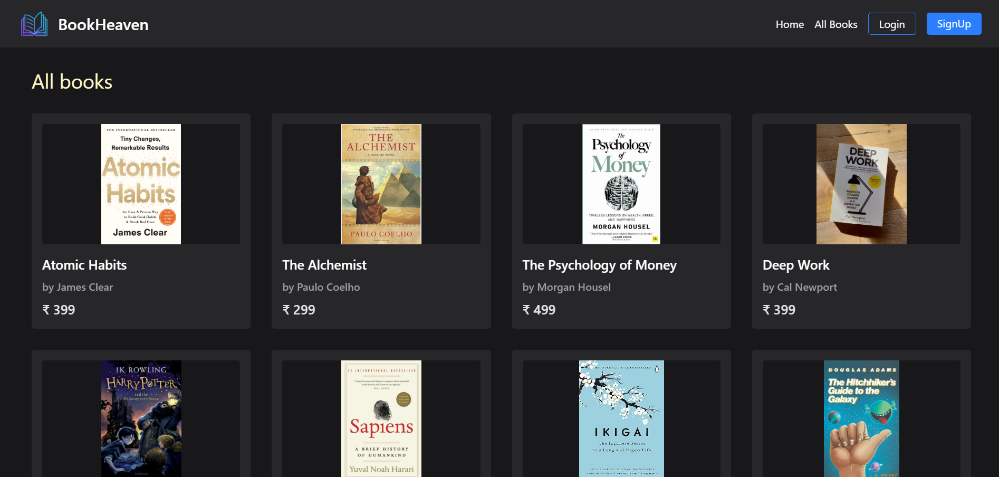

# Bookstore Management System





A fully responsive full-stack web application for managing an online bookstore with user and admin functionalities.

## Features

### User Side:
- **Home Page**: Attractive landing page with navigation bar (Home, All Books, Sign Up/Login)
- **Book Catalog**: Scrollable list of available books
- **User Authentication**: Sign Up/Login functionality
- **Book Details**:
  - View book details and author information
  - Add to Favorites
  - Add to Cart
- **Shopping Cart**:
  - Automatic total calculation
  - Order placement
- **User Profile**:
  - Favorites list
  - Order history
  - Settings (Update address)

### Admin Side:
- **Book Management**:
  - Add new books
  - Edit existing book details
  - Delete books
- **Order Management**:
  - View all orders
  - Update order status (Delivered, Cancelled, etc.)

## Technologies Used
- Frontend: React.js, TailwindCSS
- Backend: Node.js, Express.js
- Database: MongoDB
- Authentication: JWT

## Installation

### Prerequisites
- Node.js (v14+)
- MongoDB Atlas account or local MongoDB installation
- Git

### Setup

1. **Clone the repository**
```bash
git clone https://github.com/yourusername/MERN-BookStore.git
cd bookstore-management
